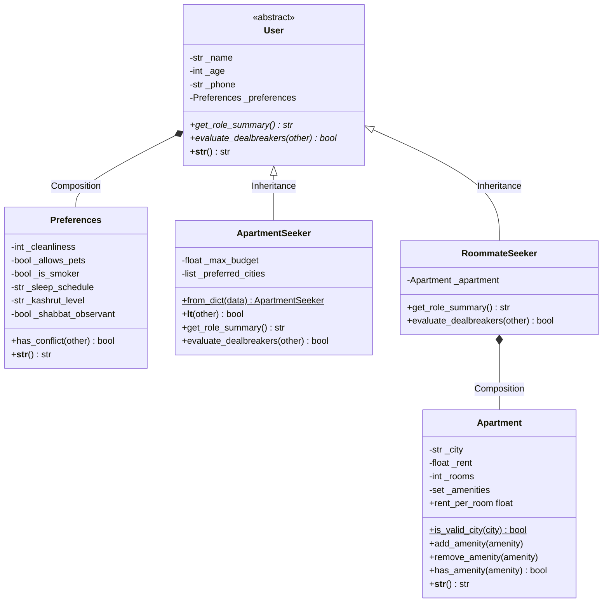
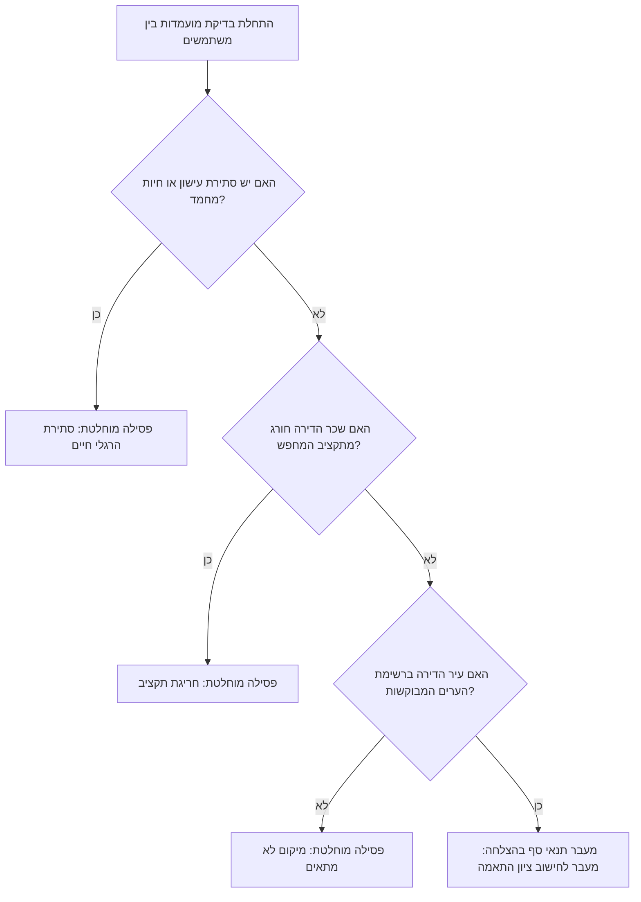

# 🏢 FlatMatch – ארכיטקטורת מודלים ותכנות מונחה עצמים (OOP)

מסמך זה מרכז ומפרט את ארכיטקטורת מחלקות המודל של מערכת **FlatMatch**, שנבנו במסגרת חלק ב' של הפרויקט בהתאם להנחיות הקורס בתכנות מתקדם.

---

## 📊 תרשימי המערכת

### 1. תרשים מחלקות וקשרים (Class Diagram)

---

### 2. תרשים זרימת בדיקת התאמה (Dealbreaker Validation Flow)

---

## 🏛️ פירוט מלא של מחלקות המערכת

### 1. מחלקת `Preferences` – ניהול הרגלי חיים והעדפות
* **מהות המחלקה:** מייצגת את סגנון החיים וההעדפות האישיות של השותף, ומשמשת כרכיב פנימי מוכל (קומפוזיציה).
* **תכונות (Attributes):**
  * `cleanliness` (מספר שלם 1 עד 5): רמת הניקיון האישית.
  * `allows_pets` (בוליאני): האם מאשר/מחזיק בעלי חיים בדירה.
  * `is_smoker` (בוליאני): האם מעשן בדירה.
  * `sleep_schedule` (מחרוזת): שעות שינה (`flexible`, `morning_person`, `night_owl`).
  * `kashrut_level` (מחרוזת): רמת כשרות (`hiloni`, `low`, `medium`, `high`).
  * `shabbat_observant` (בוליאני): האם שומר שבת.
* **מתודות עיקריות (Methods):**
  * `__init__(...)`: אתחול כל המאפיינים עם ערכי ברירת מחדל חכמים ואימות תקינות מלא.
  * `has_conflict(other)`: בודקת האם קיים קונפליקט מוחלט בין שני משתמשים (עישון הדדי, גידול בעלי חיים).
  * `__str__()`: מחזירה תיאור טקסטואלי נוח וקריא של ההעדפות.
  * `Properties & Setters`: כל התכונות מוגנות עם בדיקות טיפוסים וערכים חוקיים (זורקות `ValueError` במקרה של קלט שגוי).

---

### 2. מחלקת `Apartment` – ניהול פרטי נכס ודירה
* **מהות המחלקה:** מייצגת את הדירה הפיזית ומאפייניה, ומפרידה בין הנתונים האישיים של השותף לבין נתוני הנדל"ן.
* **תכונות (Attributes):**
  * `city` (מחרוזת באנגלית): עיר הדירה (נבדקת מול רשימת ערים מורשות).
  * `rent` (מספר עשרוני/שלם): שכר דירה חודשי כולל (מעל 0).
  * `rooms` (מספר שלם): סך החדרים בדירה (מעל 0).
  * `_amenities` (אוסף מסוג `set`): אוסף המתקנים הייחודיים בדירה.
* **תכונה מחושבת (Computed Property):**
  * `rent_per_room`: מחשבת דינמית את שכר הדירה הממוצע לחדר (`rent / rooms`).
* **מתודות עיקריות (Methods):**
  * `add_amenity(amenity: str)`: הוספת מתקן לאוסף באמצעות מתודת `add`.
  * `remove_amenity(amenity: str)`: הסרת מתקן מהאוסף באמצעות `discard`.
  * `has_amenity(amenity: str) -> bool`: בדיקת קיום מתקן בקבוצה באמצעות `in`.
  * `is_valid_city(city: str) -> bool` (**Static Method**): בדיקת עזר סטטית המוודאת שהעיר אינה ריקה ומופיעה ברשימת הערים הנתמכות (`SUPPORTED_CITIES`).
  * `__str__()`: ייצוג ידידותי של הדירה, מחירה, חלוקת החדרים ורשימת המתקנים.

---

### 3. מחלקת `User(ABC)` – מחלקת בסיס מופשטת
* **מהות המחלקה:** מגדירה את הבסיס המשותף לכל משתמשי המערכת, מממשת עקרונות הכלה והורשה, וקובעת חוזה מופשט למחלקות היורשות.
* **קומפוזיציה (Composition):**
  * מכילה אובייקט מסוג `Preferences` המאוחסן בתכונה `_preferences`.
* **תכונות (Attributes):**
  * `name` (מחרוזת): שם המשתמש (לא ריק).
  * `age` (מספר שלם): גיל המשתמש (בטווח 18–120).
  * `phone` (מחרוזת): מספר טלפון תקף.
  * `preferences` (מופע של `Preferences`).
* **מתודות עיקריות (Methods):**
  * `__init__(...)`: בנאי מאמת המגדיר שדות בסיס ומאתחל העדפות ברירת מחדל במידת הצורך.
  * `__str__()`: מחזירה תיאור תמציתי של פרטי המשתמש.
* **מתודות מופשטות (Abstract Methods):**
  * `get_role_summary()` (**`@abstractmethod`**): חוזה המחייב כל תפקיד להחזיר תיאור ייעודי של פעילותו.
  * `evaluate_dealbreakers(other)` (**`@abstractmethod`**): חוזה המחייב כל תפקיד לממש בדיקת תנאי סף ופסילות מול מועמד אחר.

---

### 4. מחלקת `ApartmentSeeker(User)` – מחפש דירה
* **מהות המחלקה:** יורשת מ-`User` ומייצגת משתמש המחפש להצטרף לדירת שותפים קיימת.
* **הורשה ושדות פרטיים (Inheritance & Private Fields):**
  * `_max_budget` (מספר חיובי): התקציב החודשי המרבי לשכירות.
  * `_preferred_cities` (רשימה `list`): רשימת ערים מועדפות למגורים.
* **בנאי אלטרנטיבי (Class Method):**
  * `from_dict(cls, data: dict)`: יצירת אובייקט ישירות מתוך מבנה נתונים מילוני (`dict`), כולל טיפול אוטומטי בהעדפות.
* **השוואה עתידית מהירה:**
  * `__lt__(self, other)`: השוואת מחפשי דירות לפי גובה התקציב (`max_budget`), המאפשרת מיון ישיר ושימוש בתור עדיפויות (`heapq`).
* **מימוש מתודות אבסטרקטיות (Polymorphism):**
  * `get_role_summary()`: מחזירה פירוט תפקיד הכולל את שם המחפש, גילו, תקרת התקציב והערים המבוקשות.
  * `evaluate_dealbreakers(other)`: בודקת האם הדירה המוצעת חורגת מתקציב המשתמש, האם העיר אינה ברשימת המבוקשות, או שיש סתירת עישון/חיות.

---

### 5. מחלקת `RoommateSeeker(User)` – מחפש שותף לחדר
* **מהות המחלקה:** יורשת מ-`User` ומייצגת בעל חוזה המחפש שותף לחדר פנוי בדירתו.
* **הרכבה (Composition):**
  * מכילה אובייקט מסוג `Apartment` בתכונה הפרטית `_apartment`.
* **מימוש מתודות אבסטרקטיות (Polymorphism):**
  * `get_role_summary()`: מחזירה תיאור תפקיד הכולל את פרטי המציע ופרטי הדירה המוצעת.
  * `evaluate_dealbreakers(other)`: בודקת האם המועמד הפוטנציאלי מסוגל לעמוד בשכר הדירה הנדרש (`max_budget >= rent`) והאם קיימת סתירת הרגלי חיים (עישון/חיות).

---

## 📋 טבלת ריכוז והשוואה של המחלקות

| שם המחלקה | קשר במערכת | תכונות מרכזיות | מתודות מרכזיות | מנגנוני OOP מיושמים |
| :--- | :--- | :--- | :--- | :--- |
| **`Preferences`** | קומפוזיציה בתוך `User` | ניקיון, עישון, חיות, שינה, כשרות, שבת | `has_conflict`, `__str__` | Encapsulation, Validation, Properties |
| **`Apartment`** | קומפוזיציה בתוך `RoommateSeeker` | עיר, שכ"ד, חדרים, אוסף מתקנים (`set`) | `add_amenity`, `remove_amenity`, `has_amenity`, `is_valid_city` | Computed Property, Static Method, Set Collection |
| **`User`** | מחלקת בסיס מופשטת | שם, גיל, טלפון, אובייקט `Preferences` | `get_role_summary`, `evaluate_dealbreakers` | Abstract Base Class (ABC), Abstract Methods, Encapsulation |
| **`ApartmentSeeker`** | יורשת מ-`User` | תקציב מקסימלי, רשימת ערים מועדפות | `from_dict`, `__lt__`, דריסת מתודות אבסטרקטיות | Inheritance, Polymorphism, Class Method, Operator Overloading |
| **`RoommateSeeker`** | יורשת מ-`User` | אובייקט `Apartment` | דריסת מתודות אבסטרקטיות | Inheritance, Composition, Polymorphism |

