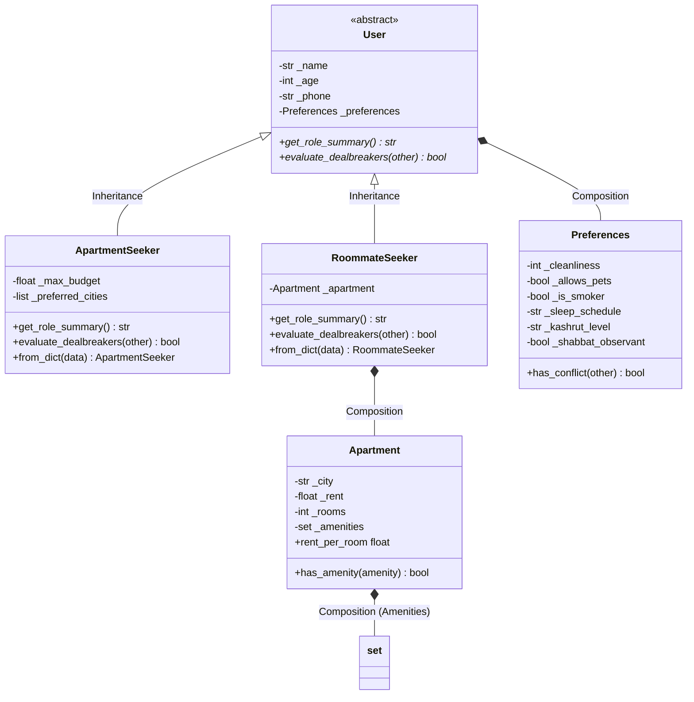

# 🏢 FlatMatch – Smart Apartment & Roommate Matching Platform

> **FlatMatch** is an intelligent shared-rental and roommate recommendation engine ("Tinder for Roommates") that matches apartment seekers with available rooms based on budget constraints, geographical preferences, lifestyle habits, and dealbreaker compatibility.

🔗 **GitHub Repository:** [https://github.com/BeRussian/FlatMatch-Final_PROJECT](https://github.com/BeRussian/FlatMatch-Final_PROJECT)

---

## 🎯 1. Project Proposal & Business Overview (חלק א')

### 1.1 Business Need and Problem Solved
Searching for roommates in metropolitan rental markets is notoriously frustrating and time-consuming, typically occurring across unstructured social media groups. Blind matches frequently result in interpersonal friction, lifestyle clashes (cleanliness discrepancies, smoking habits, conflicting sleep cycles), and broken leases.  
**The Solution:** FlatMatch transforms roommate discovery into a data-driven, structured matching process, eliminating dealbreaker mismatches upfront and streaming candidates smoothly.

### 1.2 Key Users and Roles
- **Apartment Seeker (`ApartmentSeeker`):** A tenant seeking to move into an existing shared apartment. Specifies target cities, maximum budget cap, and lifestyle preferences.
- **Roommate Seeker (`RoommateSeeker`):** A leaseholder offering an available room in their apartment. Specifies property details, monthly rent, amenities, and ideal roommate attributes.

### 1.3 Core Business Process
1. **Search Session Trigger:** A user initiates a search session (`SearchSessionContext`).
2. **Streaming & Ingestion:** Candidate records are streamed incrementally from storage (`data/sample_data.jsonl`).
3. **Early Constraint Filtering:** Hard dealbreakers (budget limits, city mismatches, smoking/pet conflicts) filter out non-viable candidates before extensive ranking.
4. **Scoring & Priority Queuing:** Compatible candidates are ranked by urgency and match scores via priority queues (`heapq`).
5. **Application Queue (FIFO):** In-demand rooms queue review applications chronologically (`collections.deque`) to guarantee fairness.
6. **Mutual Match:** Successful reciprocal acceptance establishes a verified match.

### 1.4 Business Value
- Drastic reduction in manual screening time.
- Prevention of broken leases and interpersonal disputes through algorithmic lifestyle alignment.
- Complete fairness and transparency in roommate applications.

### 1.5 Future Expansion Idea
Integration with Google Maps Commute API to automatically calculate public transit travel durations from prospective apartments to the seeker's university campus or workplace, factoring transit time directly into the ranking score.

---

## 🏛️ 2. Object-Oriented Architecture (חלק ב')



- **Inheritance & Polymorphism:** `User` is an Abstract Base Class (`ABC`). `ApartmentSeeker` and `RoommateSeeker` polymorphically implement `get_role_summary()` and `evaluate_dealbreakers()`.
- **Composition:** Every `User` contains a `Preferences` instance. `RoommateSeeker` contains an `Apartment` instance, which in turn encapsulates a `set` of amenities.
- **Validation & Properties:** Protected attributes (`_attribute`) are accessed and validated via `@property` getters and `@setter` decorators, raising clear `ValueError` exceptions on invalid inputs.

---

## 📊 3. Data Structures Table (חלק ג')

| Business Need / Process | Chosen Structure | Technical Justification |
| :--- | :--- | :--- |
| **Roommate Application Review** | `collections.deque` | **FIFO Queue:** Ensures fair, first-come, first-served application processing with $O(1)$ `append()` and `popleft()`. |
| **Urgent Candidate Matching** | `heapq` (Min-Heap) | **Priority Queue:** Urgency supersedes arrival time. Low numeric priority values are popped first in $O(\log n)$ with deterministic tie-breaking. |
| **O(1) User Lookup by Phone** | `dict` (Primary Index) | Instant retrieval by unique primary key (`phone`), with strict duplicate key rejection upon collision. |
| **Grouping & Counting by City** | `dict` (Category Map) | Dynamic aggregation of candidates by target city and frequency counting with safe `.get()` retrieval. |
| **Apartment Amenities Matching** | `set` | Mathematical set theory: intersection (`&`) for matching amenities, difference (`-`) for missing requirements, and $O(1)$ membership testing (`in`). |
| **Immutable Match Pair** | `tuple` | Heterogeneous, fixed-size record `(seeker, owner, city, rent)` that cannot be accidentally modified during transit. |
| **Ordered Mutable Candidate Pool** | `list` | Dynamic collection supporting extended unpacking (`top, runner_up, *remaining = candidates`) and in-place sorting. |

---

## 🔄 4. Mutating vs. Non-Mutating Operations Table

| Operation | Category | Description & Behavior in FlatMatch |
| :--- | :--- | :--- |
| `list.append(item)` | **Mutates Collection** | In-place addition to mutable applicant list. |
| `deque.popleft()` | **Mutates Collection** | In-place extraction of oldest application from front of FIFO queue. |
| `heapq.heappush(heap, item)` | **Mutates Collection** | In-place insertion maintaining min-heap invariant. |
| `heapq.heappop(heap)` | **Mutates Collection** | In-place removal and return of smallest/highest priority element. |
| `set.add(item)` / `set.remove(item)` | **Mutates Collection** | In-place modification of apartment amenities set. |
| `dict[key] = value` | **Mutates Collection** | In-place insertion or update in indexed repository dictionary. |
| `sorted(iterable, key=...)` | **Creates New Collection** | Returns a newly sorted `list` without altering the original sequence. |
| `[x for x in seq if cond]` | **Creates New Collection** | List comprehension returning a freshly filtered and transformed `list`. |
| `{x for x in seq}` | **Creates New Collection** | Set comprehension collecting unique values into a new `set`. |
| `{k: v for k, v in seq}` | **Creates New Collection** | Dict comprehension indexing pairs into a new `dict`. |
| `set1 & set2` / `set1 - set2` | **Creates New Collection** | Set operations generating a new `set` containing intersection or difference. |
| `(x for x in seq)` | **Creates Generator** | Evaluates elements lazily on demand without building an intermediate collection in RAM. |

---

## 🤖 5. Synthetic Data & Streaming Ingestion (חלק ד')

- **AI Source & Documentation:** 20 diverse, realistic synthetic records generated with AI in `data/sample_data.jsonl` (15 apartment seekers and 5 roommate seekers offering apartments). Full prompt, schema constraints, and error corrections are documented in [`AI_USAGE.md`](AI_USAGE.md).
- **Structure of `data/sample_data.jsonl`:** Formatted strictly as JSON Lines (one JSON object per line) containing fields for `type`, `name`, `age`, unique `phone`, nested `preferences`, and seeker-specific attributes (`max_budget`, `preferred_cities`) or apartment details (`city`, `rent`, `rooms`, `amenities`).
- **Loading Process into `dict`:** `stream_users_from_jsonl()` streams lines lazily using Python's native file iterator within `with open(..., encoding="utf-8")`. Each line is parsed into a Python `dict` via `json.loads()`. Neither `.read()` nor `.readlines()` is ever used.
- **Conversion to Domain Objects:** Raw dictionary entries are converted into domain objects via `@classmethod from_dict()` (`ApartmentSeeker.from_dict(record)` or `RoommateSeeker.from_dict(record)`), parsing nested objects (`Preferences`, `Apartment`) and converting list attributes to `set` (for apartment amenities).
- **Data Validation & Verification:** Field values are rigorously validated during instantiation via `@property` setters (checking valid ages $18 \le \text{age} \le 120$, positive budgets/rents, supported cities, and cleanliness $1 \dots 5$). `FlatMatchRepository` ensures phone number uniqueness ($O(1)$ duplicate prevention).

---

## 🔁 6. Iterators, Generators & Lazy Pipeline

### 6.1 Custom Iterable and Iterator (`iterators.py`)
- `SeekerCollection`: A custom Iterable implementing `__iter__()`.
- `SeekerIterator`: A separate Iterator class maintaining its own cursor index, implementing `__iter__()`, `__next__()`, and raising `StopIteration`.
- **Independent Traversal:** Two concurrent iterators over the same collection advance independently without interfering with each other's progress.

### 6.2 Generator Function with `yield`
`stream_budget_candidates(seekers, max_budget_ceiling)` yields candidates on demand, pausing execution state and resuming seamlessly across `next()` and `for` loops.

### 6.3 3-Stage Lazy Evaluation Pipeline
Constructed entirely using Generator Expressions without intermediate lists:
1. **Stage 1 (City Filter):** `(s for s in source if target_city in s.preferred_cities)`
2. **Stage 2 (Cleanliness Filter):** `(s for s in stage1 if s.preferences.cleanliness >= min_cleanliness)`
3. **Stage 3 (Summary Transformation):** `(f"Selected: {s.name} | Budget: {s.max_budget} | Cleanliness: {s.preferences.cleanliness}/5" for s in stage2)`

#### 💡 The 4 Mandatory Pipeline Questions:
1. **What triggers the Pipeline to start executing?**  
   Calling `next(pipeline)` pulls a result from Stage 3. This pull cascades upstream to Stage 2 and Stage 1, requesting data until a candidate satisfies all conditions.
2. **Which items did not need to be processed after stopping?**  
   Only the first 2 matching candidates were requested. Candidates appearing later in the stream were never evaluated or formatted, conserving CPU cycles and memory.
3. **What is the difference between List Comprehensions and Generator Expressions here?**  
   A list comprehension evaluates all elements immediately, allocating memory for the entire filtered array in RAM. A generator expression produces elements lazily one at a time with $O(1)$ memory consumption.
4. **Why must a new Generator be created to traverse from the beginning?**  
   Generators are single-pass state machines. Once an item is yielded, the generator cannot rewind. To restart traversal from the beginning, a new generator instance must be created.

---

## 🛡️ 7. Context Managers & Exception Safety (`context_managers.py`)

FlatMatch implements two lifecycle Context Managers using `__enter__` and `__exit__` to ensure resource cleanup and reliable state guarantees:

1. **`SearchSessionContext` (User Search Session Lifecycle):**
   - **`__enter__()`**: Initializes search session metadata, records start timestamp, marks session status as `ACTIVE`, and returns the session tracker object to the `with` block.
   - **Normal Exit (`__exit__` without exception)**: Computes elapsed time, updates status to `CLOSED`, logs performance metrics (candidates evaluated, matches discovered), and frees session resources.
   - **Behavior Upon Exception (`exc_type is not None`)**: Catches the in-flight exception, sets session status to `ABORTED_WITH_ERROR`, logs error diagnostics and duration, cleans up temporary search state, and **returns `False`** so the caller receives the unsuppressed exception for proper upstream handling.

2. **`ApartmentHoldContext` (Apartment Reservation & Rollback):**
   - **`__enter__()`**: Places the apartment in `ON_HOLD` status for a specific applicant, preventing conflicting reservations during application review.
   - **Normal Exit (`__exit__` without exception)**: Upon successful applicant review, transitions or restores apartment status smoothly.
   - **Behavior Upon Exception (`exc_type is not None`)**: Automatically triggers a state rollback, resetting the apartment status immediately back to `AVAILABLE`, logs the rollback event, and **returns `False`** so the exception propagates without being silently swallowed.

---

## 📁 8. Project File Map

```
FlatMatch-Final_PROJECT/
├── data/
│   └── sample_data.jsonl         # 20 AI-generated synthetic records
├── flatmatch/
│   ├── __init__.py               # Package definition & clean exports
│   ├── models.py                 # Domain models (User, Seekers, Apartment, Preferences)
│   ├── repository.py             # Streaming JSONL ingestion & indexed repository
│   ├── processing.py             # Data structures, queues, comprehensions & sorting
│   ├── iterators.py              # Custom iterables, generators & lazy pipeline
│   └── context_managers.py       # Search session and apartment hold lifecycle managers
├── main.py                       # Central end-to-end demonstration scenario
├── AI_USAGE.md                   # Documentation of AI tools, prompts, and validation
├── test_part_d.py                # Comprehensive test suite for Part D
├── pyproject.toml                # Standard Python package metadata
├── TASKS.md                      # Roadmap and requirements checklist
├── README.md                     # Complete project documentation and report
└── .gitignore                    # Git ignore file
```

---

## 🚀 9. Execution Instructions

### Prerequisites
- Python 3.9+ (Tested on Python 3.14)
- Standard Library only (No third-party packages required)

### Run Main Demonstration
Execute the central demonstration runner from the repository root:
```bash
python main.py
```

### Run Verification Test Suites
Run individual component tests:
```bash
python test_part_d.py
python -m flatmatch.processing
python -m flatmatch.iterators
python -m flatmatch.context_managers
```

---

## 📜 10. Git Version Control Log (`git log --oneline --graph --all`)

Below is the verified Git log output demonstrating the modular branching strategy, incremental commits, and clean merges:

```text
* a954ba2 docs(readme): add GitHub repository link, AI_USAGE.md to file map, and git graph
* 67266cf refactor(processing): prioritize intra-package relative import for models
* 544f9c2 docs(tasks): mark Parts F and G completed, finalizing all milestone 1 tasks
* b86ba79 docs(ai): add comprehensive AI_USAGE.md documentation for Part G
* 276b049 docs(tasks): mark Part E as completed in checklist
* cb739cb docs(readme): add architecture diagrams, data structure tables, lazy pipeline Q&A, and file map
* f0deddc feat(main): implement centralized end-to-end demonstration scenario
* 15a4448 feat(pkg): organize modules into flatmatch package, add __init__.py and pyproject.toml
*   223b9c3 merge: merge feature/part-d (Iterators, Generators, Context Managers) into main
|\  
| * 3319685 test(part-d): add comprehensive verification suite and mark Part D complete in TASKS.md
| * 5e830d1 feat(repository,context_managers): implement streaming jsonl repository and lifecycle context managers
| * 73e27a6 feat(iterators): implement custom iterable, iterator, generator, and lazy pipeline
|/  
* 09aa38b docs(tasks): update commit accumulation status in checklist
* d83654b style(processing): align comparison operators with course standards
* 9e40b30 refactor(processing): simplify signatures using native types and remove unused typing module
* a3b06ba feat(processing): add comprehensive validation runner and mark Part C complete in TASKS.md
* 4da2a29 feat(processing): implement comprehensions and multi-field sorting functions
* cadfd87 feat(processing): implement FIFO queue with deque and priority queue with heapq
* 77e85a6 feat(processing): implement dictionary lookups, grouping, counting, and duplicate ID handling
* db6202a feat(processing): implement list, tuple, unpacking, and set operations
* bb9c296 fix(docs): fix Mermaid diagram syntax in MODELS_SUMMARY.md for GitHub renderer
* ac15609 fix(output): ensure all runtime outputs and prints are strictly in English
* 424010e docs: add models architecture summary and project roadmap tasks checklist
* c80cc82 feat(models): implement OOP hierarchy, Apartment, Seekers, and validations
* f233aba Initial commit
```